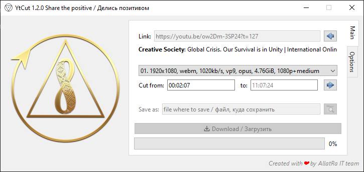

# YtCut

A simple GUI application for downloading video fragments from YouTube or other social networks. It simply wraps the console tools `yt-dlp` and `ffmpeg` to provide a tiny fraction of their immense capabilities to everyone.

_Inspired by the [Creative Society](https://creativesociety.com) international project!_

## Requirements

Application is written in [Python](https://www.python.org/) using:

- [PyQt6](https://pypi.org/project/PyQt6)
- [pathvalidate](https://pypi.org/project/pathvalidate)

Application icon was generated using [matplotlib](https://pypi.org/project/matplotlib) and [numpy](https://pypi.org/project/numpy) `Python` packages.

Also you will need the [PyInstaller](https://pypi.org/project/pyinstaller) `Python` package to create an independent executable.

## Dependencies

- [yt-dlp](https://github.com/yt-dlp/yt-dlp) as compiled executable
- and [ffmpeg](https://ffmpeg.org)

By default it is assumed that they will be placed in the `tools` directory next to `main.py` file or the `YtCut` executable. Use the `--youtube-dl` and `--ffmpeg` options to specify the actual path to each tool.
